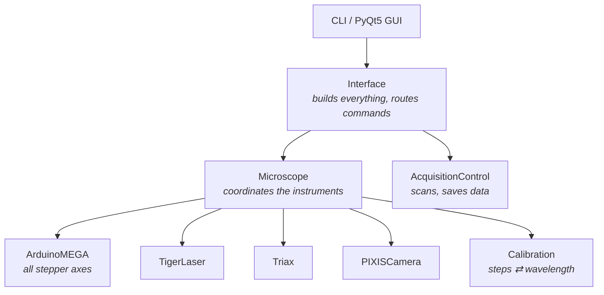

# RamanMicroscope

Control software for a tunable-excitation scanning Raman microscope, built at
the University of Melbourne.

[](https://github.com/NanoMatch1/RamanMicroscope/actions/workflows/tests.yml)
[](LICENSE)

The instrument tunes its excitation laser across the near-infrared, filters it,
scans a sample point by point, and records a Raman spectrum at every point. This
repository drives all of it — lasers, motors, spectrometer, camera and stage —
from one Python command layer, with a simulation mode complete enough to run
and test the whole application with no hardware attached.

<!-- TODO(sam): add figures/instrument.jpg — a photograph of the rig -->
> **✍️ To fill in:** photograph of the instrument, and a block diagram of the
> beam path (`figures/instrument.jpg`, `figures/optical_layout.png`). See
> [`figures/README.md`](figures/README.md).

---

## What it does

Raman spectroscopy measures the light a sample scatters *inelastically* — a
small fraction of photons come back shifted in energy by the vibrations of the
molecule or crystal they bounced off, so the spectrum is a fingerprint of
structure and bonding.

What makes this instrument unusual is that the excitation wavelength is
**tunable** rather than fixed. Most Raman microscopes have one or a few laser
lines. Here the laser sweeps continuously, which turns wavelength into an
experimental variable — the basis for resonance Raman work, where you tune onto
an electronic transition and watch particular modes amplify.

| Capability | Value | |
|---|---|---|
| Excitation tuning range | 650–1000 nm | as configured in `microscope_config.json` |
| Detection range | 500–1300 nm | monochromator, gratings and spectrometer |
| Polarisation control | excitation and collection, independently | motors `p_in` / `p_out` |
| Spatial scanning | motorised *x*, *y*, *z* stage | |
| Imaging | switchable Raman / wide-field imaging mode | |

<!-- TODO(sam): the table above is read from config and code. Confirm or correct
     against measured performance, and add: spectral resolution, achievable spot
     size, objective(s), typical acquisition time, laser power at sample,
     polarisation extinction ratio. -->
> **✍️ To fill in:** spectral resolution, spot size, objectives, typical
> acquisition times, power at sample, and what the polarisation axes can
> actually resolve. The numbers above come from the configuration file and the
> code, not from a measurement — please confirm or correct them.

### A representative measurement

<!-- TODO(sam): add figures/example_spectrum.png -->
> **✍️ To fill in:** one real spectrum — sample, excitation wavelength,
> acquisition time in the caption. This is the single most useful thing that
> could be added to this page.

---

## Hardware

| Subsystem | Device | Interface |
|---|---|---|
| Pump laser | Spectra-Physics Millennia | RS-232 |
| Tunable laser | Ti:sapphire, grating-tuned ("Tiger") | RS-232, piezomotor |
| Excitation filter | double subtractive monochromator | stepper motors |
| Spectrometer | HORIBA TRIAX | RS-232 |
| Detector | Princeton Instruments PIXIS CCD | PICam SDK via `pylablib` |
| Motion | Arduino MEGA — 4 modules, up to 4 axes each | USB serial, custom protocol |

The Arduino firmware lives in [`arduino_mega_develop/`](arduino_mega_develop/)
and is the authoritative definition of the motor command protocol. It is
versioned here alongside the Python that speaks to it, deliberately — the two
have to agree, and keeping them apart is how they stop agreeing.

<!-- TODO(sam): confirm the Millennia and Ti:sapphire model numbers, and the
     TRIAX model (320? 550?). Add the objective and grating specifications. -->
> **✍️ To fill in:** exact model numbers, grating groove densities, objective.

---

## Quickstart

```bash
git clone https://github.com/NanoMatch1/RamanMicroscope.git
cd RamanMicroscope

python -m venv .venv
source .venv/bin/activate          # Windows: .venv\Scripts\activate
pip install -r requirements-dev.txt

# 29 tests, no hardware required, about ten seconds
python -m pytest test_controller_simulated.py test_headless_simulation.py -q
```

Run the command-line interface:

```bash
python interface_run_me.py
```

On a machine without the instrument attached this starts in **simulate mode**,
where every device is replaced by a software stand-in that speaks the same
protocol. You get the full command set, and nothing physical moves.

```
> help                 # every registered command
> wai                  # "where am I" — full instrument state
> sl 800               # tune the excitation laser to 800 nm
> acquire              # take a single spectrum
```

Other entry points:

| Command | Purpose |
|---|---|
| `python interface_run_me.py` | main CLI + GUI |
| `python data_viewer_run_me.py` | offline viewer for saved spectra |
| `python calibration.py` | calibration service |

<!-- TODO(sam): there are five calibration entry points (calibration.py,
     calibration_auto.py, calibration_manual.py, calibration_scaling.py,
     calibration_shift_run_me.py) and nothing documents which to run when.
     A short "how to recalibrate this instrument" section would be valuable. -->
> **✍️ To fill in:** which calibration program to run, when, and in what order.
> There are currently five and no guidance.

> ⚠️ Simulate mode is currently selected by a path-and-platform heuristic rather
> than an explicit flag, so check which mode the application reports at startup.
> Tracked as `MODERNIZATION.md` 1.5.

---

## How it is built

The design goal throughout: **hardware should be swappable without rewriting
the code that uses it.** Instruments in a research lab get replaced, borrowed
and upgraded constantly, and a codebase that hard-codes a particular camera
dies with that camera.



`Interface` builds every hardware object and hands them to `Microscope`.
`Microscope` is the functional core: it knows that "go to 800 nm" means moving
laser motors, reading a spectrum, finding the peak, moving grating motors and
returning the system to a ready state — a single logical request fanning out
across four devices.

### Dependency injection

> **In plain terms (for the scientists):** a component is never allowed to
> reach out and grab the things it needs — a serial port, a config file, a
> camera. Those are *handed to it* when it is created. It is the difference
> between a detector that only works when bolted to one particular optical
> table, and one you can carry to another bench and plug in.

Concretely, `Microscope` never opens a serial port or imports a camera driver.
It receives already-constructed objects:

```python
microscope = Microscope(interface, calibration_service, controller,
                        camera, spectrometer, simulate=simulate)
```

That single property is what makes both simulation and hardware swaps possible:
passing a simulated camera instead of a real one requires no change inside
`Microscope` at all.

### Swappable hardware, demonstrated

Each device class exposes a small logical interface — `grab_frame()`,
`set_acquisition_time()`, `go_to_wavelength()` — and hides everything
vendor-specific behind it.

This is easy to claim and hard to prove, so: in August 2026 the instrument's
Ti:sapphire laser was replaced (Spectra-Physics Tsunami → Tiger) and its camera
was replaced (Tucsen → Princeton Instruments PIXIS), and the spectrometer moved
from GPIB to RS-232. All three landed by writing new device classes and changing
the lines that construct them. `Microscope` was not restructured. The commit
history shows it.

### The command registry

Every user-facing method is marked with a decorator and registered in one place:

```python
@ui_callable
def go_to_laser_wavelength(self, wavelength):
    ...

self.command_functions = {'sl': self.go_to_laser_wavelength, ...}
```

At construction, `Instrument._integrity_checker()` asserts that the decorated
methods and the registry agree in both directions. `Interface` then flattens
every component's registry into one command map — roughly 95 commands — shared
by the CLI and the GUI.

> **In plain terms (for the scientists):** there is exactly one list of what the
> instrument can be told to do, and the software refuses to start if that list
> disagrees with the code. Adding a command means editing one place. Forgetting
> to register one is caught immediately at startup, not silently at the bench
> at 2 a.m.

This is the repository's answer to a specific failure mode: a help menu, a
command parser and a set of methods that drift apart until the documentation
lies.

### Simulation as a first-class mode

Every instrument has a simulated counterpart implementing the same interface,
including a fake Arduino that speaks the real serial protocol byte for byte.
This is not a stub for tests — it is how the application is developed and
reviewed from another continent, and how a student can learn the command set
without risking the optics.

---

## Repository map

| Path | Contents |
|---|---|
| `interface_run_me.py` | entry point — builds and wires everything |
| `microscope.py` | the `Microscope` orchestration class, the functional core |
| `controller.py` | Arduino MEGA serial protocol and motion control |
| `calibration.py` | steps ⇄ wavelength conversion service |
| `simulation.py` | simulated hardware for every device |
| `instruments/` | device classes — `lasers/`, `spectrometers/` |
| `pixisspec/` | Princeton Instruments PIXIS camera interface |
| `acquisitioncontrol/` | scan orchestration and the PyQt5 GUI |
| `datafit/` | peak fitting — Gaussian, Lorentzian, Voigt |
| `arduino_mega_develop/` | controller firmware, authoritative for the protocol |
| `calibration/`, `autocalibration/` | stored calibration data |
| `tools/` | standalone diagnostics, not imported by the application |
| `docs/` | contributor guide and lab PC verification procedure |

### Motor addressing

Motors carry human-readable labels (`g1`–`g4` for gratings, `p_in`/`p_out` for
polarisation, `x`/`y`/`z` for the stage) which `Microscope.action_groups` maps
to Arduino IDs of the form `[module][axis]` — `3Z`, `4X`, `2A`. Calling code
never sees the hardware IDs, so rewiring a motor to a different driver module
is a configuration change rather than a code change.

---

## Testing

Two suites, both hardware-free, both required to pass before a change is
considered complete:

```bash
python -m pytest test_controller_simulated.py test_headless_simulation.py -q   # 29 tests
```

- **`test_controller_simulated.py`** (9) — the Arduino command protocol at the
  wire level.
- **`test_headless_simulation.py`** (20) — the whole application driven through
  its real command handler, with stdin replaced by an empty stream so that any
  interactive prompt fails immediately instead of hanging a headless run.

CI runs both on every push and pull request.

**Scope, honestly:** these cover the motor protocol and orchestration well.
They do not yet cover the laser, spectrometer and camera device classes, the
calibration programs, the fitting code, or the GUI. That is a deliberate
position for a hardware project rather than an oversight — but it is where new
tests are most welcome.

---

## Known limitations

`MODERNIZATION.md` is the standing technical-debt backlog and is kept honest
rather than aspirational. The current headline items:

- `microscope.py` is 2825 lines and should be several modules.
- Serial ports are hard-coded rather than configured.
- Simulate mode is chosen by a heuristic, not an explicit flag.
- Two `Instrument` base classes with the same name coexist.
- Whether the Raman/imaging mode motor has a limit switch is unresolved, so
  mode switching currently steps open-loop.

`CHANGELOG.md` records functionally significant changes.

---

## Contributing

Working on the code? [`docs/git_workflow.md`](docs/git_workflow.md) — eight
rules, one line of reasoning each.

Deploying to or verifying the instrument?
[`docs/lab_pc_verification.md`](docs/lab_pc_verification.md).

---

## Licence

MIT — see [LICENSE](LICENSE).

Built by Samuel Brooke. If you use this in published work, a citation is
appreciated.

<!-- TODO(sam): add a CITATION.cff if there is a paper to point at. -->
